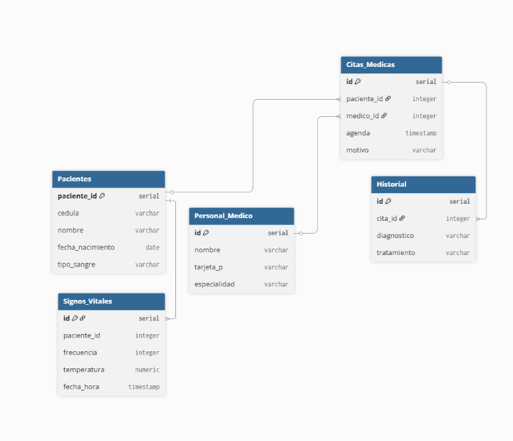

# Taller_HealthPulse

## Modularidad
*¿qué tan fácil es separarlo del resto de la base de datos según su diseño?*

En caso tal que el modulo de signos vitales se vuelve grande y toca migrarlo, encontraremos un problema ya que este depende de paciente, una alternativa seria comunicar estos dos factores mediante una API y no mediante una foreign key.

## Acoplamiento
*¿Qué tabla es el "punto central" del sistema? ¿Qué pasaría si esa tabla sufre un cambio estructural profundo?*

Para este sistema el punto central seria la tabla de citas medicas ya que este tiene multiples dependencias que comunican tanto al paciente como al medico, sin esta tabla no existe una idea de negocio o estructura con un contexto practico.

En caso tal que se hagan cambios estructurales en esta tabla se podria dañar la logica para las consultas y generar mas oportunidades para fallos o incoherencias, un ejemplo seria el modificar la logica del ON DELETE, si se alteran estas normas se podrian eliminar datos sin querer.

## COHESIÓN

*¿Por qué es un error de diseño poner el diagnóstico médico directamente
en la tabla de la Cita Médica en lugar de una tabla de Historia Clínica?*

En un contexto real no siempre una cita medica tendra un diagnostico elaborado como chequeos rutinarios, otra interferencia se puede identificar en el proposito de la tabla y el dato especifico la tabla de cita medica cumple una función de servir como agenda y organizador entre los factores, mientras que el dato de diagnostico deberia pertenecer más al historial clinico que es información especificamente del estado del paciente. 
